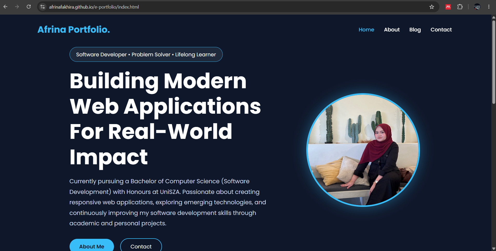
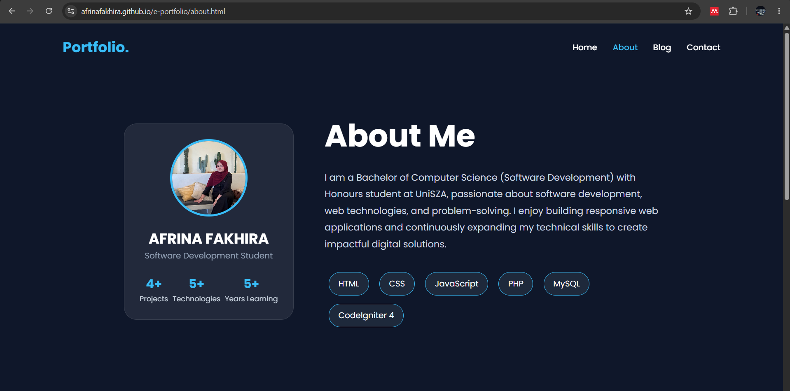
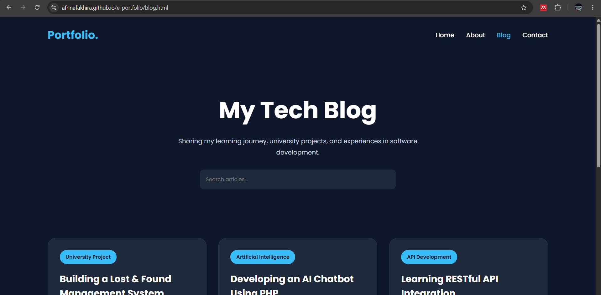
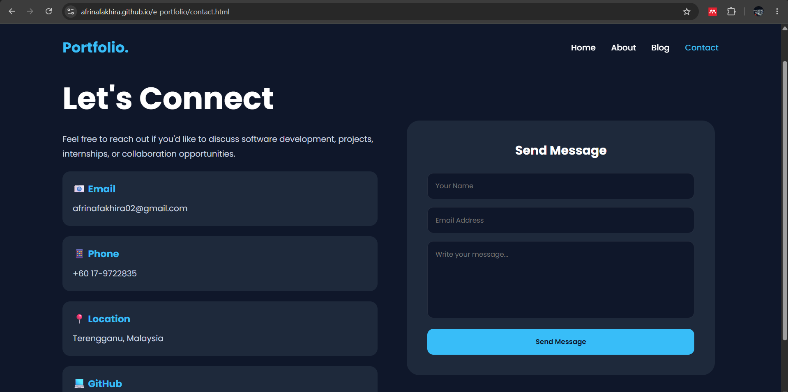

# Personal Blog Portfolio

## Description
A responsive personal blog website developed using HTML, CSS and JavaScript.

## Features
- Home Page
- About Page
- Blog Page
- Contact Page
- Blog Search
- Responsive Design

## Technologies Used
- HTML
- CSS
- JavaScript

## How to Run
1. Download project
2. Open index.html

## Screenshots
### Homepage

### About

### Blog

### Contact

## GitHub Repository
https://github.com/afrinafakhira/e-portfolio

## Demo
(Add GitHub Pages link)
